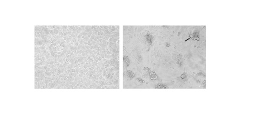

### Theory

A viral titer refers to the number of infectious virus particles per unit volume, where an infectious unit is the minimum amount of virus that produces visible effects, such as cytopathic effect (CPE) in host cells. The median tissue culture infectious dose (TCID₅₀) is the dilution of a virus required to infect 50% of a given cell culture [1]. This assay measures infectious virus titre.

Viruses can only replicate within living host cells; therefore, cell culture systems are essential for determining viral infectivity. In the TCID₅₀ assay, a susceptible cell line is infected with serial dilutions of a virus sample. After infection, the cells are examined microscopically for virus-induced morphological changes such as cell rounding, detachment, syncytia formation, or cell lysis, collectively known as cytopathic effects. The TCID₅₀ assay is based on the probability of infection. As the virus is diluted, fewer infectious particles are present, leading to fewer wells showing CPE. The dilution at which 50% of the wells show CPE is calculated using methods such as the Reed-Muench or Spearman–Kärber methods. The final result is expressed as TCID₅₀ per millilitre (TCID₅₀/mL).

  
  
Figure 1. Baby Hamster kidney cells-21 infected with Newcastle disease virus, showing cytopathic effect

The TCID₅₀ assay is particularly useful for viruses that do not form clear plaques. It is commonly applied in virology research, vaccine development, antiviral screening, and virus standardization studies.